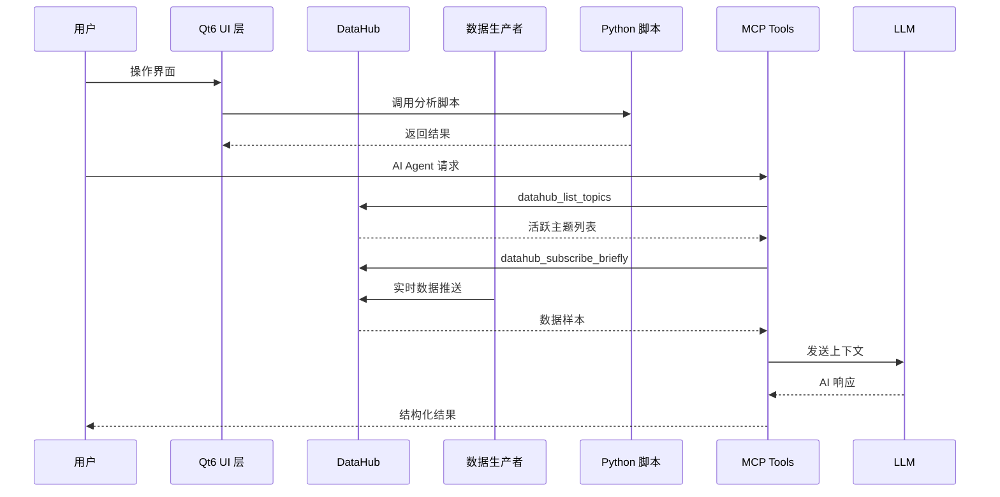
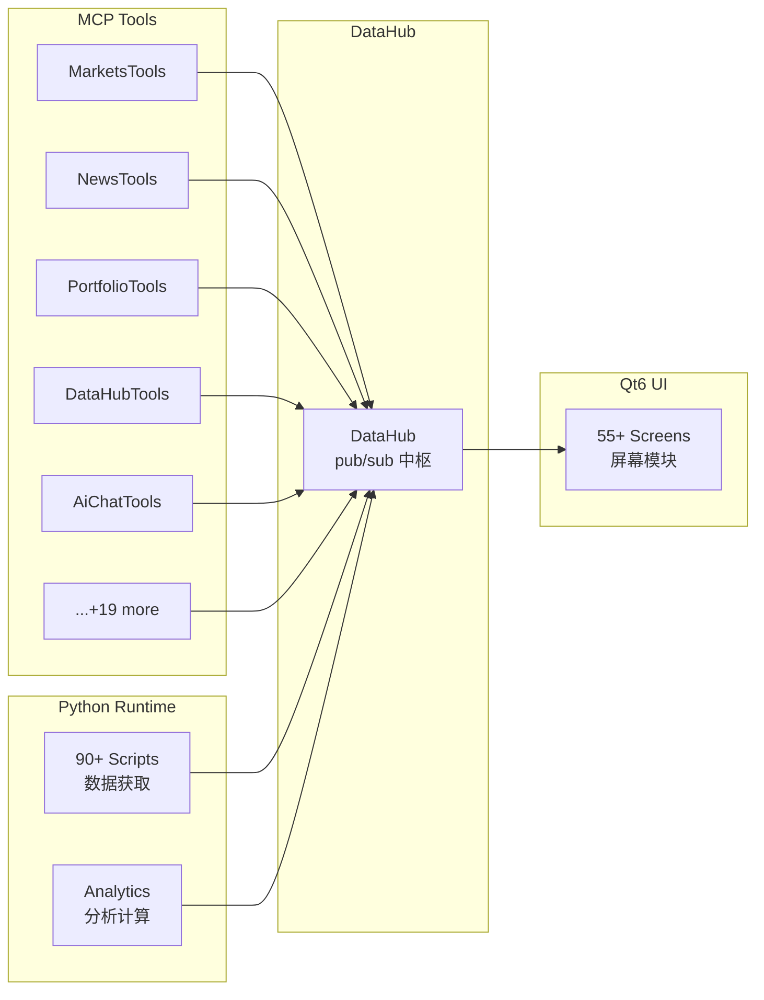

# Fincept Terminal 架构文档

## 1. 项目概述

**Fincept Terminal v4** 是一个纯原生 C++20 桌面应用程序，使用 Qt6 渲染 UI，嵌入式 Python 执行分析计算，以单一原生二进制形式交付专业级终端性能。

### 技术栈

| 层级 | 技术 | 说明 |
|------|------|------|
| **语言** | C++20 | 核心业务逻辑、UI 渲染 |
| **UI 框架** | Qt 6.8.3 | 跨平台桌面 GUI |
| **分析引擎** | Python 3.11+ | 嵌入式脚本执行分析计算 |
| **构建系统** | CMake 3.27 + Ninja | 多平台统一构建 |
| **协议层** | MCP (Model Context Protocol) | AI Agent 工具调用接口 |
| **数据中枢** | DataHub (内存 pub/sub) | 进程内实时数据分发 |
| **许可证** | AGPL-3.0 + 商业许可 | 开源 + 商业双授权 |

### 平台支持

- **Windows x64** — MSVC 2022 17.8+ (CMake preset: `win-release`)
- **Linux x64** — GCC 12.3+ (CMake preset: `linux-release`)
- **macOS ARM** — Apple Clang 15.0+ / Xcode 15.2+ (CMake preset: `macos-release`)

---

## 2. 技术架构

### 2.1 整体架构图

```mermaid
graph TB
    subgraph Application["Fincept Terminal (单进程二进制)"]
        subgraph QtUI["Qt6 UI 层"]
            Dashboard["Dashboard\n仪表盘"]
            MarketPanel["MarketPanel\n市场面板"]
            Watchlist["WatchlistScreen\n自选股"]
            Portfolio["PortfolioBlotter\n投资组合"]
            EquityRes["EquityResearch\n股票研究"]
            News["News\n新闻"]
            NodeEdit["NodeEditor\n节点编辑器"]
            Crypto["Crypto Center\n加密货币中心"]
            AIChat["AiChat\nAI 对话"]
            Settings["Settings\n设置"]
        end

        subgraph CPPCore["C++20 核心层"]
            App["Application\n主应用"]
            Navigation["NavigationService\n导航服务"]
            Theme["ThemeSystem\n主题系统"]
            Config["ConfigManager\n配置管理"]
        end

        subgraph DataLayer["数据层"]
            DataHub["DataHub\n内存 pub/sub 中枢"]
            DataSources["DataSources\n数据源聚合"]
            Broker["Broker Adapters\n16 家券商适配"]
            WebSocket["WebSocket Clients\n实时行情"]
        end

        subgraph MCP["MCP 工具层 (24+ 模块)"]
            McpMgr["McpManager\nMCP 服务器管理"]
            ToolRetriever["ToolRetriever\n工具检索"]
            
            subgraph Tools["MCP Tools"]
                DataHubTools["DataHubTools\n数据中枢工具"]
                MarketsTools["MarketsTools\n市场数据工具"]
                NewsTools["NewsTools\n新闻工具"]
                PortfolioTools["PortfolioTools\n组合工具"]
                AiChatTools["AiChatTools\nAI 对话工具"]
                NavigationTools["NavigationTools\n导航工具"]
                SettingsTools["SettingsTools\n设置工具"]
                FileManagerTools["FileManagerTools\n文件管理工具"]
                CryptoTradingTools["CryptoTradingTools\n加密交易工具"]
                PaperTradingTools["PaperTradingTools\n模拟交易工具"]
                WatchlistTools["WatchlistTools\n自选股工具"]
                MAAnalyticsTools["MAAnalyticsTools\n并购分析工具"]
                ReportBuilderTools["ReportBuilderTools\n报告构建工具"]
                DataSourcesTools["DataSourcesTools\n数据源工具"]
                MetaTools["MetaTools\n元工具"]
                ProfileTools["ProfileTools\n配置工具"]
                ForumTools["ForumTools\n论坛工具"]
                NotesTools["NotesTools\n笔记工具"]
                SystemTools["SystemTools\n系统工具"]
                PythonTools["PythonTools\nPython 执行工具"]
                AltInvestmentsTools["AltInvestmentsTools\n另类投资工具"]
                EdgarTools["EdgarTools\nSEC EDGAR 工具"]
            end
        end

        subgraph Python["嵌入式 Python"]
            PythonRT["Python Runtime\nPython 运行时"]
            PythonScripts["scripts/\n90+ 数据获取脚本"]
            QuantLib["QuantLib\n量化金融库"]
            Analytics["Analytics\n分析计算模块"]
        end

        subgraph Agents["AI Agents"]
            TraderAgents["37 个 Trader/Investor Agents\nBuffett, Graham, Lynch..."]
            EconomicAgents["Economic Agents\n经济分析 Agent"]
            GeopoliticsAgents["Geopolitics Agents\n地缘政治 Agent"]
            LLMProviders["LLM Providers\nOpenAI, Anthropic, Gemini..."]
        end
    end

    subgraph External["外部服务"]
        Exchanges["交易所 API\nPolygon, Kraken, Yahoo..."]
        Brokers["券商 Broker API\nZerodha, Angel One, IBKR..."]
        GovDB["政府数据库\nDBnomics, FRED, IMF, World Bank..."]
        LLMs["LLM 服务\nOpenAI, Anthropic, Gemini..."]
        MCP Servers["外部 MCP Servers\n可配置扩展"]
    end

    %% Connections
    Dashboard --> CPPCore
    MarketPanel --> CPPCore
    CPPCore --> DataLayer
    DataLayer --> DataHub
    DataHub --> MCP
    MCP --> Tools
    CPPCore --> Python
    Python --> PythonScripts
    Python --> Analytics
    MCP --> Agents
    Agents --> LLMProviders
    CPPCore --> External
    DataLayer --> External
```

### 2.2 数据流架构



### 2.3 DataHub 主题体系

DataHub 是进程内 pub/sub 数据中枢，所有实时数据流通过主题名路由：

| 主题家族 | 示例 | 说明 |
|---------|------|------|
| `market:quote:*` | `market:quote:AAPL` | 实时报价 |
| `market:sparkline:*` | `market:sparkline:MSFT` | 分时 sparkline |
| `market:history:*:*:*` | `market:history:TSLA:1d:5m` | K 线历史 |
| `ws:kraken:*` | `ws:kraken:ticker:BTC-USD` | Kraken WebSocket |
| `ws:hyperliquid:*` | `ws:hyperliquid:trades:BTC` | HyperLiquid 推送 |
| `news:*` | `news:general`, `news:symbol:NVDA` | 新闻流 |
| `economics:*:*` | `economics:fred:UNRATE` | 宏观经济数据 |
| `broker:*:*:*` | `broker:zerodha:acc1:positions` | 券商账户数据 |
| `geopolitics:*` | `geopolitics:event:*` | 地缘政治事件 |
| `maritime:*` | `maritime:vessel:IMO123` | 船舶追踪 |
| `ma:*` | `ma:dcf:AAPL` | 并购分析模型 |
| `agent:*` | `agent:stream:run_id` | Agent 输出流 |
| `llm:session:*` | `llm:session:sess1:stream` | LLM token 流 |

---

## 3. 模块结构

### 3.1 源码目录

```
fincept-terminal/
├── fincept-qt/                        # 主应用目录
│   ├── CMakeLists.txt                 # CMake 根配置 (C++20, Qt6, 编译器检查)
│   ├── CMakePresets.json              # 平台构建预设 (win/linux/macos)
│   │
│   ├── src/                           # C++ 源码
│   │   ├── mcp/                       # MCP 协议层
│   │   │   ├── McpManager.cpp/h       # MCP 服务器生命周期管理
│   │   │   ├── McpTypes.h             # 类型定义
│   │   │   ├── ToolRetriever.cpp      # 工具检索
│   │   │   └── tools/                 # 24+ MCP 工具模块
│   │   │       ├── DataHubTools.cpp/h  # DataHub 工具 (list/peek/request/subscribe)
│   │   │       ├── MarketsTools.cpp/h  # 市场数据工具
│   │   │       ├── NewsTools.cpp/h     # 新闻工具
│   │   │       ├── PortfolioTools.cpp/h # 投资组合工具
│   │   │       ├── AiChatTools.cpp/h   # AI 对话工具
│   │   │       ├── NavigationTools.cpp/h # 导航控制工具
│   │   │       ├── SettingsTools.cpp/h  # 设置工具
│   │   │       ├── CryptoTradingTools.cpp/h # 加密交易工具
│   │   │       ├── PaperTradingTools.cpp/h  # 模拟交易工具
│   │   │       ├── WatchlistTools.cpp/h # 自选股工具
│   │   │       ├── MAAnalyticsTools.cpp/h   # 并购分析工具
│   │   │       ├── ReportBuilderTools.cpp/h # 报告构建工具
│   │   │       ├── DataSourcesTools.cpp/h   # 数据源配置工具
│   │   │       ├── FileManagerTools.cpp/h   # 文件管理工具
│   │   │       ├── MetaTools.cpp/h      # 元工具
│   │   │       ├── ProfileTools.cpp/h  # 配置工具
│   │   │       ├── ForumTools.cpp/h     # 论坛工具
│   │   │       ├── NotesTools.cpp/h     # 笔记工具
│   │   │       ├── SystemTools.cpp/h    # 系统工具
│   │   │       ├── PythonTools.cpp/h    # Python 执行工具
│   │   │       ├── AltInvestmentsTools.cpp/h # 另类投资工具
│   │   │       ├── EdgarTools.cpp/h     # SEC EDGAR 工具
│   │   │       └── ThreadHelper.h       # 线程辅助
│   │   │
│   │   ├── services/                  # 服务层
│   │   ├── screens/                   # UI 屏幕 (55+)
│   │   ├── models/                    # 数据模型
│   │   ├── storage/                   # 持久化存储
│   │   ├── core/                      # 核心组件 (logging, config...)
│   │   └── network/                   # 网络通信
│   │
│   ├── scripts/                        # 90+ Python 数据获取脚本
│   │   ├── market_data/               # 市场数据脚本
│   │   ├── news/                      # 新闻爬取脚本
│   │   ├── economics/                 # 经济数据脚本
│   │   └── crypto/                    # 加密货币脚本
│   │
│   ├── resources/                      # 资源文件 (图标、demo 数据)
│   │
│   ├── docs/                          # 文档
│   │   ├── MCP_TOOLS_GUIDE.md         # MCP 工具完整指南
│   │   ├── DATAHUB_TOPICS.md          # DataHub 主题目录
│   │   ├── agents/                    # Agent 相关文档
│   │   │   └── datahub-guide.md       # DataHub Agent 使用指南
│   │   └── datahub-phases/            # DataHub 迁移阶段文档
│   │
│   ├── plans/                         # 未来阶段规划
│   │
│   └── packaging/                      # 打包配置
│       ├── installer/                 # Qt IFW Windows 安装器
│       └── linux/                     # Linux AppImage 配置
```

### 3.2 主要模块关系



---

## 4. 构建系统

### 4.1 CMake 配置要点

```cmake
# 编译器版本强制检查 (跨平台保证)
if(MSVC AND MSVC_VERSION LESS 1938)
    message(FATAL_ERROR "MSVC 19.38+ required")
endif()

# C++20 标准
set(CMAKE_CXX_STANDARD 20)
set(CMAKE_CXX_STANDARD_REQUIRED ON)

# Qt6 组件
find_package(Qt6 6.8 REQUIRED COMPONENTS
    Widgets Charts PrintSupport Network Sql Concurrent Multimedia)

# 第三方依赖 (FetchContent)
# - QXlsx (Excel 导出)
# - md4c (Markdown 解析)
# - QuantLib (量化金融)
```

### 4.2 构建预设

| 预设名 | 平台 | 构建类型 | 用途 |
|--------|------|----------|------|
| `win-release` | Windows | Release | 正式发布 |
| `win-debug` | Windows | Debug | 调试 |
| `win-fast` | Windows | RelWithDebInfo | 快速迭代 |
| `win-release-lto` | Windows | Release + LTO | 极限优化 |
| `linux-release` | Linux | Release | 正式发布 |
| `linux-debug` | Linux | Debug | 调试 |
| `macos-release` | macOS | Release | 正式发布 |
| `macos-debug` | macOS | Debug | 调试 |

### 4.3 关键构建特性

- **Unity Build**: CMAKE_UNITY_BUILD=ON, 批量大小 14，加速基础设施层编译
- **ccache/sccache**: 编译器缓存支持，PCH-aware 配置
- **LTO (Link-Time Optimization)**: 默认关闭，CI 和 ship build 可选启用
- **Qt 版本严格绑定**: 6.8.3 EXACT 模式确保 ABI 稳定
- **跨平台资源编译**: RC 编译器自动检测 (Windows SDK)

---

## 5. 数据层 (DataHub)

> 详见 [datahub.md](./datahub.md)

### 5.1 核心概念

DataHub 是进程内 pub/sub 数据中枢，提供：

- **主题发布/订阅**: 所有数据通过主题名发布，UI 组件和 MCP 工具按需订阅
- **4 个 MCP 工具**: `datahub_list_topics`, `datahub_peek`, `datahub_request`, `datahub_subscribe_briefly`
- **速率控制**: 每个生产者独立 rate-limit，防止 API 滥用
- **缓存合并**: 高频数据 (token 流、tick 数据) 在策略层合并
- **一次性主题**: Agent 输出和 LLM 会话主题在完成后自动销毁，防止内存泄漏

### 5.2 数据生产者

| 生产者类型 | 示例 | 数据流 |
|-----------|------|--------|
| **Python 脚本** | `scripts/market_data/yahoo_finance.py` | REST API 拉取 → Hub |
| **WebSocket 客户端** | `ws:kraken`, `ws:hyperliquid` | 实时推送 → Hub |
| **券商适配器** | 16 家券商 (Zerodha, IBKR...) | 账户/订单数据 → Hub |
| **系统事件** | Agent 输出、LLM token 流 | 进程内事件 → Hub |

---

## 6. 屏幕模块 (55+)

主要屏幕模块：

| 模块 | 说明 |
|------|------|
| **Dashboard** | 仪表盘，概览全市场 |
| **MarketPanel** | 市场面板，实时行情 |
| **WatchlistScreen** | 自选股管理 |
| **PortfolioBlotter** | 投资组合明细 |
| **EquityResearch** | 股票研究，DCF 等分析 |
| **News** | 新闻聚合与监控 |
| **NodeEditor** | 可视化节点编辑器，自动化工作流 |
| **Crypto Center** | 加密货币中心 |
| **AiChat** | AI 对话界面 |
| **PaperTrading** | 模拟交易 |
| **DataSources** | 数据源配置 |
| **Settings** | 系统设置 |

---

## 7. 技术特性

### 7.1 性能优化

- **单一二进制分发**: 无需运行时依赖 (除系统 Qt 库)
- **增量链接**: 非 LTO 构建默认开启，调试迭代快速
- **ccache 集成**: 增量编译 5-20x 加速
- **Unity Build**: 减少编译单元数量

### 7.2 安全特性

- **PIN 认证**: 交易操作需 PIN 验证
- **主题级速率限制**: 防止 API 滥用
- **地理围栏**: Alpha Arena 模式地区限制
- **AGPL-3.0 + 商业许可**: 双重授权

### 7.3 可扩展性

- **MCP 外部服务器**: 可配置第三方 MCP 服务
- **Python 脚本热加载**: 90+ 数据脚本可扩展
- **主题化系统**: 完整主题切换支持

---

*文档版本: v4.0.2 | 最后更新: 基于 fincept-qt 源码结构*
